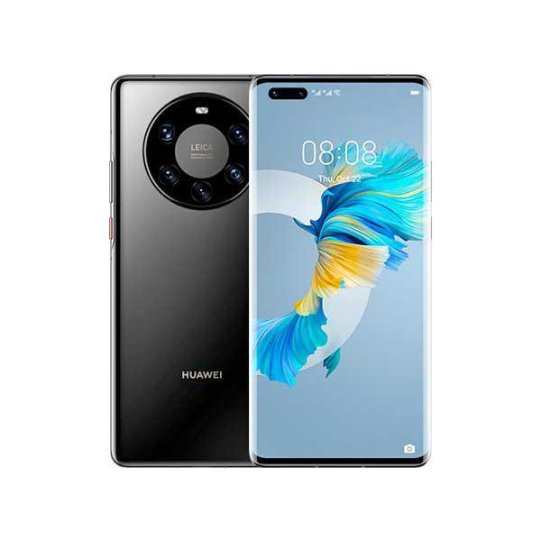

# Mobile Phone Company

## Stakeholders

* customers: 30-50 year old women
* Owners: People who own the company
* Developers: me

## specification

* Color
* Typography
* Design
* Layout
* Imagery
* Navigation

## interests 
* Customers

    * Product information 
        * At least the top 5 phones.
        * Images
        * A brief description about the phone.

    * Simple(easy to navigate)
        * (Specifications)

    * Quick loading

* Owners

    * Needs to look good
    * Professional
    * Generate business 
    * Cheap

* Developers
 
    * Well Documented 
    * Maintainable
    * Easy to test
    * Standards

# colour

i chose these colour scheme because of my Research i have seen a few websites use a type of blue colour and i think it works great with a website about phones and also i chose these colour because they are eye catching but not to bright. i also chose this because of colour blind people.

first colour pallet [Pallet 1](https://paletton.com/#uid=a3+4B1ksutJhCBymDvauynIzSiIku2kglOrHr1otAGfRM6at)

* primary colour

    * .color-primary-0 { color: #2828A6 }	
    * .color-primary-1 { color: #6767C2 }
    * .color-primary-2 { color: #4545AE }
    * .color-primary-3 { color: #191984 }
    * .color-primary-4 { color: #0E0E68 }

* complementary colour 

    * .color-complement-0 { color: #420E6D }	
    * .color-complement-1 { color: #6A3694 }
    * .color-complement-2 { color: #551C83 }
    * .color-complement-3 { color: #310555 }
    * .color-complement-4 { color: #200238 }

i will be using primary colour 0 for the navigation bar and i will be using the primary colour 2 for the phone list drop list. i will also be using the complementary colour 0 for links i have been on before and the links i am on right now.the text will be all black.

second colour pallet [Pallet 2](https://paletton.com/#uid=a3+3l1ktBohv57yuxgPtpxMq6KpkCczknzKZsTG6A6poBJjg)

* primary colour

    * .color-primary-0 { color: #e61b00 }
    * .color-primary-1 { color: #ff452c }
    * .color-primary-2 { color: #ff2407 }
    * .color-primary-3 { color: #b51500 }
    * .color-primary-4 { color: #840f00 }

*  complementary colour 

    * .color-complement-0 { color: #8a0070 }
    * .color-complement-1 { color: #dc00b2 }
    * .color-complement-2 { color: #ac008b }
    * .color-complement-3 { color: #6c0057 }
    * .color-complement-4 { color: #3f0033 }

for my second pallet i will use the same as the first one but i will make the dropdown box that your on complementary colour 2 so you know where you are.

# fonts

[font 1](https://fonts.google.com/specimen/Prompt?category=Serif,Sans+Serif#standard-styles) Prompt, Regular 400

font-family: 'Prompt', sans-serif;

i will use the first font for heading/subheadings mainly. i chose this font because is very similar to the regular one and a lot of websites use the regular font so i think it will work well with my website.

[font 2](https://fonts.google.com/specimen/Crimson+Pro?category=Serif,Sans+Serif)

font-family: 'Crimson Pro', serif;

i will use my second font as the main one for writing. the reason i used this font is because very similar to the regular but a bit more fancy so i am sure that this will work well as the main font.

# Navigation

H = Home page

L = login page

Numbered = phone pages

|   |  H |  L |   1 |   2 |  3 |   4 |  5 |   6 |  7 |   8 |  9 |   10|
|---| -- | --- | -- | --- | -- | --- | -- | --- | -- | --- | -- | --- |
| H | ✅ | ✅ | ✅ | ✅ | ✅ | ✅ | ✅ | ✅ | ✅ | ✅ | ✅ | ✅ |
| L | ✅ | ✅ | ❌ | ❌ | ❌ | ❌ | ❌ | ❌ | ❌ | ❌ | ❌ | ❌ |
| 1 | ✅ | ❌ | ✅ | ✅ | ✅ | ✅ | ✅ | ✅ | ✅ | ✅ | ✅ | ✅ |
| 2 | ✅ | ❌ | ✅ | ✅ | ✅ | ✅ | ✅ | ✅ | ✅ | ✅ | ✅ | ✅ |
| 3 | ✅ | ❌ | ✅ | ✅ | ✅ | ✅ | ✅ | ✅ | ✅ | ✅ | ✅ | ✅ |
| 4 | ✅ | ❌ | ✅ | ✅ | ✅ | ✅ | ✅ | ✅ | ✅ | ✅ | ✅ | ✅ |
| 5 | ✅ | ❌ | ✅ | ✅ | ✅ | ✅ | ✅ | ✅ | ✅ | ✅ | ✅ | ✅ |
| 6 | ✅ | ❌ | ✅ | ✅ | ✅ | ✅ | ✅ | ✅ | ✅ | ✅ | ✅ | ✅ |
| 7 | ✅ | ❌ | ✅ | ✅ | ✅ | ✅ | ✅ | ✅ | ✅ | ✅ | ✅ | ✅ |
| 8 | ✅ | ❌ | ✅ | ✅ | ✅ | ✅ | ✅ | ✅ | ✅ | ✅ | ✅ | ✅ |
| 9 | ✅ | ❌ | ✅ | ✅ | ✅ | ✅ | ✅ | ✅ | ✅ | ✅ | ✅ | ✅ |
| 10| ✅ | ❌ | ✅ | ✅ | ✅ | ✅ | ✅ | ✅ | ✅ | ✅ | ✅ | ✅ |

# information on the page

# phones

## phone 1

Samsung Galaxy S21 Ultra

SMOOTH SCROLLING: The 120Hz display delivers a super smooth scroll, with optimized refresh rate, and a fast touch response gives seamless visuals in both work and play

REAL DISPLAY VISION: The high quality display with Dynamic AMOLED 2X delivers vibrant color and brightness, even in bright sunlight

PRO-GRADE CAMERA: The powerful pro grade camera delivers high quality photos and videos, with a Rear Camera that boasts 12MP Ultra Wide, Wide-angle cameras and an 8MP Telephoto Camera; It also features a Front Camera that includes a 32MP Selfie Camera

30X SPACE ZOOM: 30x SpaceZoom combines a 3x Hybrid Optic Zoom and 30x digital zoom for high resolution close ups, while the EngageZoom Lock reduces shakiness the further your zoom in

SUPERIOR PERFORMANCE: The power-efficient processor chip offers reliability and performance that boosts every experience, from graphic-heavy gaming to multitasking.

ALL DAY INTELLIGENT POWER: The 4500mAh intelligent battery outlasts the day, even on 5G, while Super Fast Charging can charge 50% in 30 minutes.

£949.00

## phone 2

iphone 13 pro max

6.7-inch Super Retina XDR display with ProMotion for a faster, more responsive feel

Cinematic mode adds shallow depth of field and shifts focus automatically in your videos

Pro camera system with new 12MP Telephoto, Wide, and Ultra Wide cameras; LiDAR 

Scanner; 6x optical zoom range; macro photography; Photographic Styles, ProRes

video, Smart HDR 4, Night mode, Apple ProRAW, 4K Dolby Vision HDR recording

12MP TrueDepth front camera with Night mode, 4K Dolby Vision HDR recording

A15 Bionic chip for lightning-fast performance

Up to 28 hours of video playback, the best battery life ever in an iPhone

Durable design with Ceramic Shield

Industry-leading IP68 water resistance

5G capable

iOS 15 packs new features to do more with iPhone than ever before

£1049.00

## phone 3

OnePlus 9 Pro

Hasselblad Camera for Mobile - Take your best shot with the OnePlus 9 Pro 5G’s Quad Camera system co-developed by Hasselblad, featuring a 48MP main camera, 50MP Ultra-Wide camera, 8MP telephoto camera, and 2MP monochrome lens

Qualcomm Snapdragon 888 - Powered by the most powerful Snapdragon platform yet, the OnePlus 9 Pro 5G delivers fast and smooth performance across every app

A Day’s Power in 15 Minutes - Take wired charging to the next level with Warp Charge 65T, or charge wirelessly at ridiculous speeds with Warp Charge 50 Wireless requires optional wireless charging pad

Next-Generation Fluid Display - The 6.7” QHD+ display delivers stunning visuals at 120 Hz with next-generation LTPO technology that conserves battery. Enhance your gaming experience with HyperTouch, a new technology that delivers more responsive gaming in select titles

Alexa Support - Simply by saying "Alexa", you can play music, make calls, hear the news, or check the weather wherever you are. Download the Alexa app, complete setup and just ask - and Alexa will respond instantly

If your device is not receiving text messages or experiencing error when making phone calls, you need to contact carriers' technical support to add CDMALess feature

Display type: AMOLED

Connector type: USB Type C

£538.99

## phone 4

Cubot Note 20 Pro

Big Capacity: Equipped with 8GB RAM+128GB ROM; Powered by MT6771 Helio P60, Octa-core processor; Android 10 system

Big Screen: 6.5 inch bezel-less Dewdrop display screen;2.5D curved glass

Quad Rear Camera :12.0MP IMX486 Main Camera+Dual sub Camera+Photosensitive Lens; 8.0MP AI beauty front camera

Other Function:4200mAh Detachable Battery+OTG+NFC+Face ID+Triple Card slots(4G Dual Nano Sim Cards+a SD card space up to 128 GB)+3.5 mm headphone jack

Network:4G FDD (B2/4/5/7/12/17/28A+B) 3G: (B2/4/5),2G GSM: US compatibility Nationwide on all GSM Networks including AT&T, T-Mobile, Cricket, Metro PCS, and others. Not compatible with CDMA Networks like Verizon, Sprint and Boost Mobile.

£599.99

## phone 5

Google Pixel 6

Unlocked Android 5G phone gives you the flexibility to change carriers and choose your own data plan[1]; Pixel 6 is fast, smart, and secure, and adapts to you
The powerful Google Tensor processor is the first processor designed by Google and made for Pixel; it keeps your phone fast, your games rich, and your personal info safe

Pixel’s 50 megapixel rear camera captures 150% more light for photos with richer colors and more detail[2]

Professional tools like Magic Eraser[3], Motion Mode, and Portrait Mode keep your photos sharp, accurate, and focused

Pixel’s fast charging[4] all day battery adapts to you and saves power for apps you use most[5]

Privacy and protection are built into your Pixel smartphone; backed by the Titan M2 security chip, 5 years of updates, and the security core[6]

New Pixel experience is more modern and intuitive, with colors that reflect your personal style; the At a Glance feature shows you the apps and info you need when you need it, like a boarding pass before a flight[7]

Live Translate helps you translate live video captions, private chats and messages, and signs in up to 55 languages right on your cell phone[8]; no apps, internet, or language courses required[9]

New 6.4 inch Smooth Display[10] is made with the toughest Gorilla Glass yet[11] to keep your smartphone protected; the high refresh rate means more responsive gaming and scrolling

Please refer to the product description section below for all applicable legal disclaimers denoted by the bracketed numbers in the preceding bullet points (e.g., [1], [2], etc.)

£599.00

## phone 6

Xperia 5 III

Variable tele lens and Dual PD sensor with Real-time Eye AF

360 Reality Audio through its speakers, 360 Spatial Sound up-mixing

120Hz 6.1” HDR OLED display “powered by CineAlta”

Triple camera with four focal lengths and object tracking

Win with Game Enhancer’s custom display, audio and mic settings

Evolved Full-stage front facing stereo speakers for enhanced sound

Use as high-quality external monitor and live stream from your camera

IP65/68 water resistance and Corning Gorilla Glass 6 display

5G connectivity and speed; Qualcomm Snapdragon 888 5G Mobile Platform

Long 4500mAh battery life charges up to 50% capacity in 30 minute

£998.00

# design

I did some research on some phone company's and with the information i have gathered from then i 
have made two layouts for my website both using different colour scheme 
# layout 1

## colour

With the research i did i have chosen a colour scheme to go with the first layout i have chosen this colour scheme because i have realized that a lot of phone company's make there web pages a type of blue colour. the blue i used is an eye caching colour and its also easy on colour blind people.

first colour scheme [click here](https://paletton.com/#uid=a3+4B1ksutJhCBymDvauynIzSiIku2kglOrHr1otAGfRM6at)

* primary colour

    * .color-primary-0 { color: #2828A6 }	
    * .color-primary-1 { color: #6767C2 }
    * .color-primary-2 { color: #4545AE }
    * .color-primary-3 { color: #191984 }
    * .color-primary-4 { color: #0E0E68 }

* complementary colour 

    * .color-complement-0 { color: #420E6D }	
    * .color-complement-1 { color: #6A3694 }
    * .color-complement-2 { color: #551C83 }
    * .color-complement-3 { color: #310555 }
    * .color-complement-4 { color: #200238 }

# layout 2

* primary colour

    * .color-primary-0 { color: #e61b00 }
    * .color-primary-1 { color: #ff452c }
    * .color-primary-2 { color: #ff2407 }
    * .color-primary-3 { color: #b51500 }
    * .color-primary-4 { color: #840f00 }

*  complementary colour 

    * .color-complement-0 { color: #8a0070 }
    * .color-complement-1 { color: #dc00b2 }
    * .color-complement-2 { color: #ac008b }
    * .color-complement-3 { color: #6c0057 }
    * .color-complement-4 { color: #3f0033 }

internal external camera 

anti glare 

OLED screen